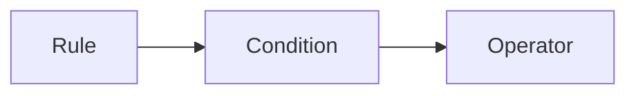

# @arunkumar_h/rule-engine

[](https://www.npmjs.com/package/@arunkumar_h/rule-engine)
[](https://www.npmjs.com/package/@arunkumar_h/rule-engine)
[](https://github.com/arunkumar-h/rule-engine/blob/main/LICENSE)
[](https://bundlephobia.com/package/@arunkumar_h/rule-engine)
[](https://packagephobia.com/result?p=@arunkumar_h/rule-engine)

<!-- [](badges/badge-branches.svg)
[](badges/badge-functions.svg)
[](badges/badge-lines.svg)
[](badges/badge-statements.svg) -->

> A lightweight and extensible rule engine built with TypeScript and Node.js. Define complex business rules and evaluate conditions easily using a simple JSON structure.

## 📦 Installation

```bash
npm install @arunkumar_h/rule-engine
```

```bash
yarn add @arunkumar_h/rule-engine
```

## 🧠 Features

- ✅ Supports `and`, `or`, and nested logical conditions
- 🔧 Custom operators and facts
- 📜 Written in TypeScript, fully typed
- 🚀 Lightweight
- 🔎 Built-in [JMESPath](https://jmespath.org/) support for powerful data querying

### Default Operators

The following operators are available by default:

- `===`: Strict equality check
- `!==`: Strict inequality check
- `>`: Greater than
- `>=`: Greater than or equal to
- `<`: Less than
- `<=`: Less than or equal to
- `==`: Loose equality check
- `!=`: Loose inequality check
- `like%`: Ends with
- `%like`: Starts with
- `%like%`: Includes
- `in`: Value is in the given array
- `!in`: Value is not in the given array
- `includes`: Value includes the given value
- `!includes`: Value does not include the given value

### Adding Rule

- `name` identifies the name of the rule. The name should always be unique. A single engine cannot have the same rule added more than once.
- `condition` This containes `and` and `or` as main block.
- `onSuccess` value that will be returned or function that will be invoked if the condition is satisfied.
- `onFail` value that will be returned or function that will be invoked if the condition fails.

```javascript
import { Engine } from "@arunkumar_h/rule-engine";

const engineObj = new Engine();
const rule = {
  name: "testRule",
  condition: {
    and: [
      { path: "age", operator: "!==", value: 10 },
      {
        and: [
          { path: "age", operator: ">", value: 15 },
          {
            or: [
              { path: "age", operator: "!==", value: 30 },
              { path: "skills", operator: "includes", value: "ts" },
            ],
          },
        ],
      },
      { path: "language", operator: "in", value: ["tamil", "english"] },
    ],
  },
  onSuccess: () => "Success", // onSuccess: { id: 23 }
  onFail: () => "Fail", // onFail: "Error"
  cache: false,
};
engine.addRule(rule);
```

```javascript
import { Engine } from "@arunkumar_h/rule-engine";
const engineObj = new Engine();
const condition1 = {
  name: "condition1",
  condition: {
    and: [
      { path: "age", operator: "!==", value: 10 },
      {
        and: [
          { path: "age", operator: ">", value: 15 },
          {
            or: [
              { path: "age", operator: "!==", value: 30 },
              { path: "skills", operator: "includes", value: "ts" },
            ],
          },
        ],
      },
      { path: "language", operator: "in", value: ["tamil", "english"] },
    ],
  },
};
const rule = {
  name: "testRule",
  condition: "condition1",
  onSuccess: () => "Success",
  onFail: () => "Fail",
};
engine.addRule(rule);
engine.addCondition(condition1);
```

## 📘 API



#### `let engine = new Engine()`

Creates a new instance of the RuleEngine.

#### `engine.addRule(namedRule)` or `engine.addRule([namedRule[0], namedRule[1]....])`

Provision to add named rules to engine dynamically.

#### `engine.addCondition(nammedCondition)` or `engine.addCondition([nammedCondition[0], nammedCondition[1]....])`

Provision to add new condition to engine dynamically.
Condition can invoke another namedCondition.

#### `engine.addOperator(nammedOperator)` or `engine.addOperator([nammedOperator[0], nammedOperator[1]....])`

Provision to add new operator to engine dynamically.
Operator can also be an async function.

## 🛠️ Advanced Usage

## 📄 License

[MIT](./LICENSE)
