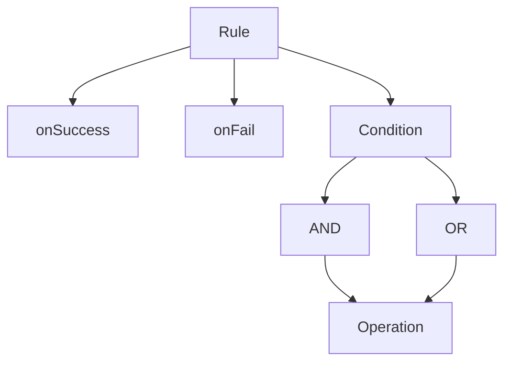

# @arunkumar_h/rule-engine

[](https://www.npmjs.com/package/@arunkumar_h/rule-engine)
[](https://www.npmjs.com/package/@arunkumar_h/rule-engine)
[](https://github.com/arunkumar-h/rule-engine/blob/main/LICENSE)
[](https://bundlephobia.com/package/@arunkumar_h/rule-engine)
[](https://packagephobia.com/result?p=@arunkumar_h/rule-engine)

[](badges/badge-branches.svg)
[](badges/badge-functions.svg)
[](badges/badge-lines.svg)
[](badges/badge-statements.svg)

> A lightweight and extensible rule engine built with TypeScript and Node.js. Define complex business rules and evaluate conditions easily using a simple JSON structure.

## 📦 Installation

```bash
npm install @arunkumar_h/rule-engine
```

```bash
yarn add @arunkumar_h/rule-engine
```

## 🧠 Features

- ✅ Logical condition support (and, or, nested expressions)
- 🔧 Custom operators and named conditions
- 📜 Fully typed with TypeScript
- 🚀 Lightweight and dependency-aware
- 🔎 Native [JMESPath](https://jmespath.org/)  support for data querying
- 🧰 Built-in caching using [`lru-cache`](https://isaacs.github.io/node-lru-cache/)  for better performance

## ⚙️ Default Operators

The following operators are available by default:

| Operator | Description |
| --- | --- |
| === | Strict equality |
| !== | Strict inequality |
| == | Loose equality |
| != | Loose inequality |
| > | Greater than |
| >= | Greater than or equal to |
| < | Less than |
| <= | Less than or equal to |
| %like | Starts with |
| like% | Ends with |
| %like% | Contains |
| in | Value is in the array |
| !in | Value is not in the array |
| includes | Array includes value |
| !includes | Array does not include value |

## 🔨 Basic Usage

- `condition` This containes `and` and `or` as main block.
- `onSuccess` value that will be returned or function that will be invoked if the condition is satisfied.
- `onFail` value that will be returned or function that will be invoked if the condition fails.
- `cache` as default this will be set to `true` and can be disabled for rule wise `false`

```javascript
import { Engine } from "@arunkumar_h/rule-engine";

const engineObj = new Engine();
const rule = {
  testRule: {
    condition: {
      and: [
        { path: "age", operator: "!==", value: 10 },
        {
          and: [
            { path: "age", operator: ">", value: 15 },
            {
              or: [
                { path: "age", operator: "!==", value: 30 },
                { path: "skills", operator: "includes", value: "ts" },
              ],
            },
          ],
        },
        { path: "language", operator: "in", value: ["tamil", "english"] },
      ],
    },
    onSuccess: (fact, ruleName) => "Success", // onSuccess: { id: 23 }
    onFail: (fact, ruleName) => "Fail", // onFail: "Error"
    cache: false, // default will be true
  }
};
engine.addRule(rule);

const fact = {age: 16, skills: ["ts", "php"], language: "tamil"}; // Your data to be validated 
const result = await engineObj.run(fact, "testRule");
```
## 🔍 API Overview



### Engine API

```javascript
let engine = new Engine() 
```

addRule({ rule1, rule2, ... })
- Add named rules dynamically.

addCondition({ condition1, condition2, ... })
- Add reusable named conditions.
- Conditions can reference other named conditions.

addOperator({ customOperator1, customOperator2, ... })
- Add custom (sync or async) operators.

run(fact, ruleName)
- Executes a given rule against the provided fact


## ⚡ Advanced Usage

- Adding named conditions.
- Adding named operators.
- Rule wise cache disabling.

```javascript
import { Engine } from "@arunkumar_h/rule-engine";

const engineObj = new Engine();

const condition1 = {
  condition1: {
    and: [
      { path: "age", operator: "!==", value: 10 },
      {
        and: [
          { path: "age", operator: ">", value: 15 },
          {
            or: [
              { path: "age", operator: "!==", value: 30 },
              { path: "skills", operator: "includes", value: "ts" },
            ],
          },
        ],
      },
      { path: "language", operator: "in", value: ["tamil", "english"] },
    ],
  }
};
engine.addCondition(condition1);  // adding named condition

const rule = {
  testRule: {
    condition: "condition1",  // Using named condition
    onSuccess: "Success",  //  can be a function or a data
    onFail:  "Fail", //  can be a function or a data
    cache: false  // disable cache for this rule 
  }
};
engine.addRule(rule);

const fact = {age: 16, skills: ["ts", "php"], language: "tamil"}; // Your data to be validated 
const result = await engineObj.run(fact, "testRule");
```

## 🔧 Custom Operator Example
```javascript
engine.addOperator({
  isEven: (factValue) => factValue % 2 === 0,
});

const rule = {
  evenCheck: {
    condition: {
      and: [
        { path: "number", operator: "isEven" },
      ],
    },
    onSuccess: "Number is even",
    onFail: "Number is odd",
  },
};

const result = await engine.run({ number: 8 }, "evenCheck");
```

## 🧪 Test Coverage
Badges above represent live coverage stats for:

- [](badges/badge-branches.svg)
- [](badges/badge-functions.svg)
- [](badges/badge-lines.svg)
- [](badges/badge-statements.svg)


## 📄 License

[MIT](./LICENSE)
